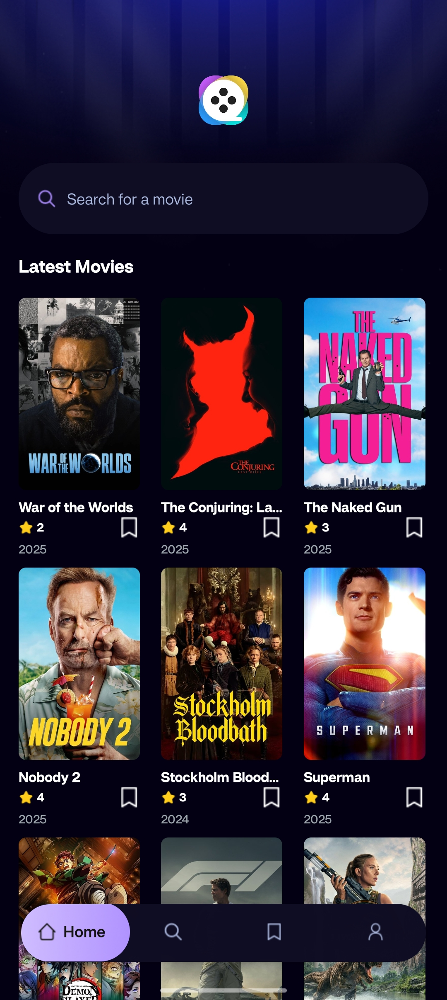
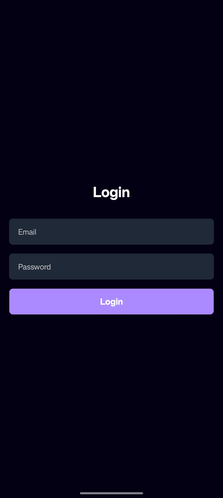
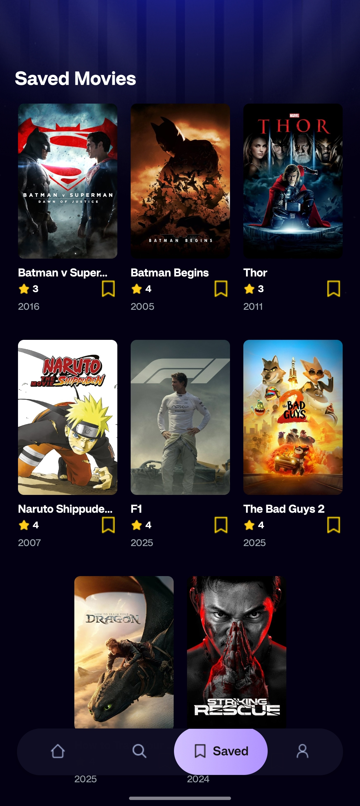
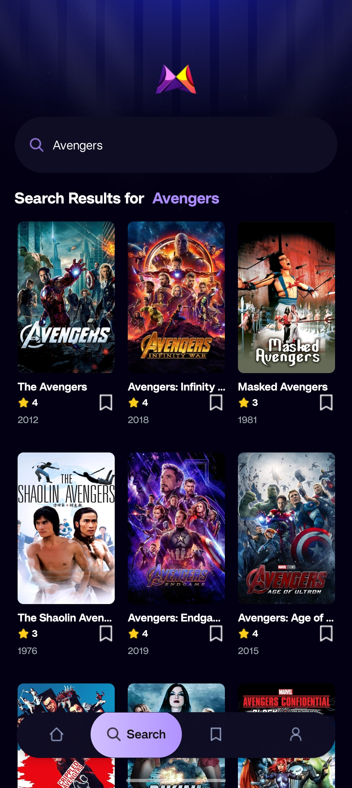

# Cinemate Mobile

A mobile application for browsing, searching, and saving movies, built with React Native and Expo.

## Features

- User authentication (login/logout)
- Browse movies
- Search for movies
- Save favorite movies
- User profile management

## Screenshots

<table>
  <tr>
    <td></td>
    <td></td>
    <td></td>
  </tr>
  <tr>
    <td></td>
    <td></td>
    <td></td>
  </tr>
</table>

## Installation

To run this project locally, follow these steps:

1.  **Clone the repository:**

    ```bash
    git clone https://github.com/HARD1Kk/Cinemate-Mobile.git
    cd Cinemate-Mobile
    ```

2.  **Install dependencies:**

    ```bash
    npm install
    # or yarn install
    ```

3.  **Start the Expo development server:**

    ```bash
    npx expo start --tunnel 
    ```

    This will open a new tab in your browser with Expo Dev Tools. You can then run the app on an iOS simulator, Android emulator, or your physical device.
4.  **Install Expo Go on your mobile device and scan the QR code:**

    - Download the **Expo Go** app from the [App Store (iOS)](https://apps.apple.com/us/app/expo-go/id1397950279) or [Google Play Store (Android)](https://play.google.com/store/apps/details?id=host.exp.exponent&hl=en&gl=US).
    - After running `npx expo start --tunnel` (as described in step 3), a QR code will be displayed in your terminal or browser.
    - Open the Expo Go app on your phone and scan the QR code to open the app on your device.

## Usage

- **Login/Register:** log in to access the app's features.
- **Browse:** Explore a wide range of movies.
- **Search:** Use the search bar to find specific movies.
- **Save:** Mark movies as favorites to easily access them later.
- **Profile:** Manage your user profile.

## Technologies Used

- [React Native](https://reactnative.dev/)
- [Expo](https://expo.dev/)
- [NativeWind](https://www.nativewind.dev/) (for Tailwind CSS)
- [React Navigation](https://reactnavigation.org/)
- React Context API

## Contributing

Contributions are welcome! Please follow these steps:

1.  Fork the repository.
2.  Create a new branch (`git checkout -b feature/your-feature-name`).
3.  Make your changes.
4.  Commit your changes (`git commit -m 'feat: Add new feature'`).
5.  Push to the branch (`git push origin feature/your-feature-name`).
6.  Open a Pull Request.


## Contact

If you have any questions or suggestions, feel free to reach out:

- Name : [Hardik](mailto:hardik216730@example.com)
- Project Link: [Project Link](https://github.com/HARD1Kk/Cinemate-Mobile)